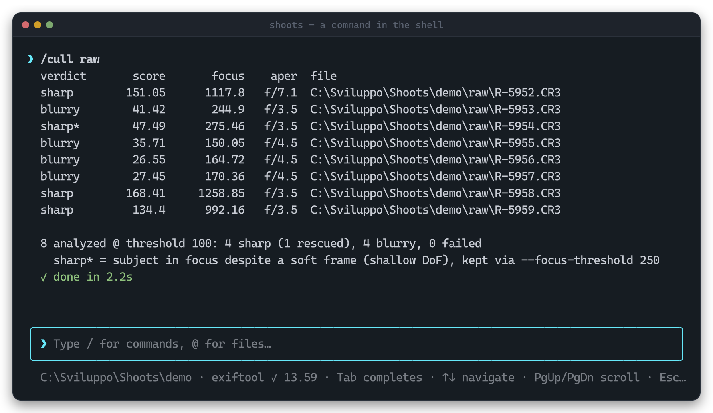

<p align="center">
  
</p>

<h1 align="center">shoots</h1>

<p align="center">
  <b>Your own develop style, learned locally and predicted on the next shoot.</b><br/>
  A scriptable command-line tool that does the tedious work around your editor.
</p>

---

## What is it

`shoots` trains a **develop profile on the catalog you have already edited**, and then
predicts a per-image develop starting point for photographs it has never seen — written
as XMP sidecars your editor opens. The same idea as the assisted-developing services
photographers subscribe to, with one difference that changes everything about it: the
model is fitted by your own machine, on your own photographs, and **nothing is ever
uploaded**.

It is **not** an editor and **not** a catalog. It sits before and after your editor and
automates the parts of a shoot that are not photography:

- **Learn your edit** — fit a predictor from an already-developed catalog, get a
  per-image starting point, and `refine` it with the corrections you actually made.
- **Learn your eye** — duel your own photos two at a time and train a rating profile
  that generalizes your taste to work you have never judged.
- **Cull the out-of-focus frames** with focus-aware blur detection — shallow depth of
  field included — with an optional human-in-the-loop review.
- **Star-rate and keyword** your images with a local AI model, written as XMP sidecars.
- **Offload and rename** a card into a dated catalog, checksum-verified.
- **Stamp metadata** (artist, copyright, keywords, any EXIF/IPTC/XMP tag) on a folder.

Three rules never bend: **nothing is ever deleted or overwritten** (originals stay
untouched, edits go to sidecars), **everything runs locally** — no cloud, no upload — and
**the CLI stays free**, with no subscription for anything documented here. Every command
speaks `--json` and honours `--dry-run`, so it drops straight into scripts, cron and CI.

### Editors

Develop settings are not portable between hosts, so each editor gets its own adapter.
**Lightroom Classic, Camera Raw and Bridge are supported today**; darktable, RawTherapee,
RapidRAW, ON1 Photo RAW and Capture One are queued. See
[Direction](./docs/roadmap.md).

<p align="center">
  
</p>

## Getting started

Install the standalone binary — no Node.js required.

**macOS / Linux**

```sh
curl -fsSL https://www.shoots-ai.com/install.sh | bash
```

**Windows (PowerShell)**

```powershell
irm https://www.shoots-ai.com/install.ps1 | iex
```

Or grab the binary for your platform from the
**[latest release](https://github.com/stefanopascazi/shoots/releases/latest)**.

Then:

```sh
shoots setup     # download the external tools and the AI model into ~/.shoots
shoots doctor    # check that everything is in place
shoots           # open the interactive shell (or use any command directly)
```

Your first import:

```sh
shoots import E:/DCIM/100CANON --dest D:/Shoots/2026/smith-wedding --dry-run
```

## Documentation

**[Read the guide →](./docs/README.md)**

[Getting started](./docs/getting-started.md) ·
[Core concepts](./docs/concepts.md) ·
[Command reference](./docs/commands/README.md) ·
[Interactive shell](./docs/shell.md) ·
[Recipes](./docs/recipes.md) ·
[Troubleshooting](./docs/troubleshooting.md) ·
[Development](./docs/development.md)

## License

**Source-available, not open source.** `shoots` is licensed under the
[PolyForm Noncommercial License 1.0.0](./LICENSE).

You are free to read, use, modify, and share the source code — but **only for
noncommercial purposes**. Any commercial use of the software, in whole or in
part, is not permitted under this license.

Copyright © 2026 Stefano Pascazi. All commercial rights are reserved by the
copyright holder. For a commercial license, contact stefanopascazi@gmail.com.
